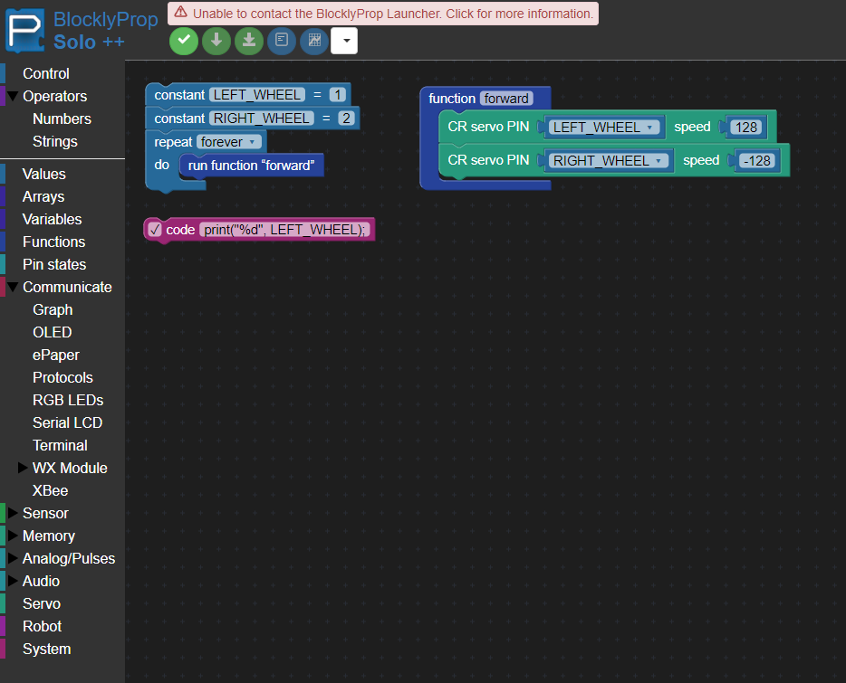
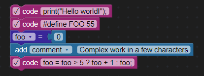
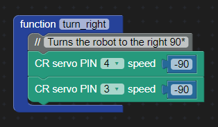

# Solo++

My fork of [Parallax Inc's Solo Propeller C Blockly Editor](https://github.com/parallaxinc/solo).  
This was made out of pretty much frustration with features when using this for a school project and lack of raw propeller C access.

[Try Me](https://dvvcz.github.io/solo/index.html)

## Differences

__Dark Mode__  
Both the ace editor and blockly editors are in dark mode now.  

__``code`` block__  
This block has been added to the blockly editor (system tab), which just inserts code (almost) inline, besides adding a new line.  
Much smaller and easier to use than the regular ``User defined code`` block.  

__``comment`` block__
New comment block has been added, pretty much entirely cosmetic (saves space and is more obvious, however.)  
Same as the ``Add 'comment'`` block, except gray and starts with ``//``  

## Note
Big thanks to Parallax for making this open source, there are other *much* worse projects (looking at you code.org) that are unfortunately closed source so I cannot meddle with them and publish my changes.